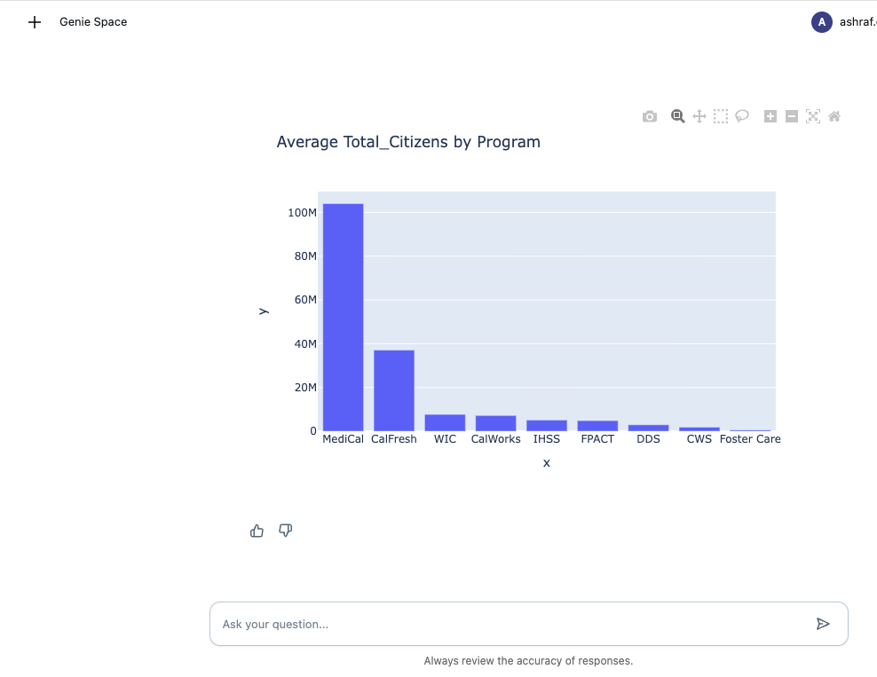

# Databricks Genie API Integration Demo


This repository demonstrates how to integrate Databricks' AI/BI Genie Conversation APIs into custom Databricks Apps applications, allowing users to interact with their structured data using natural language.

You can also click the Generate insights button and generate deep analysis and trends of your data.


Integrated interactive visualizations


## Overview

This app is a Dash application featuring a chat interface powered by Databricks Genie Conversation APIs, built specifically to run as a Databricks App. This integration showcases how to leverage Databricks' platform capabilities to create interactive data applications with minimal infrastructure overhead.

The Databricks Genie Conversation APIs (in Public Preview) enable you to embed AI/BI Genie capabilities into any application, allowing users to:
- Ask questions about their data in natural language
- Get SQL-powered insights without writing code
- Follow up with contextual questions in a conversation thread

## Key Features

- **Powered by Databricks Apps**: Deploy and run directly from your Databricks workspace with built-in security and scaling
- **Zero Infrastructure Management**: Leverage Databricks Apps to handle hosting, scaling, and security
- **Workspace Integration**: Access your data assets and models directly from your Databricks workspace
- **Natural Language Data Queries**: Ask questions about your data in plain English
- **Stateful Conversations**: Maintain context for follow-up questions with enhanced conversation history
- **Advanced User Authentication**: Robust user identity management with support for multiple authentication methods
- **Enhanced User Experience**: Personalized interface with user avatars and email display
- **Comprehensive Auditing**: Complete logging and tracking of all Genie conversations, prompts, responses, and SQL queries
- **Data Visualization**: Interactive charts and graphs with Plotly integration for automatic data visualization
- **AI-Powered Insights**: Generate deep analysis and trends from your data using LLM-powered insights

## Example Use Case

This demo shows how to create a simple interface that connects to the Genie API, allowing users to:
1. Start a conversation with a question about their supply chain data
2. View generated SQL and results
3. Ask follow-up questions that maintain context

## User Experience Features

### Enhanced User Identity Management
The application now features comprehensive user authentication and identity retrieval with support for:

- **Multiple Authentication Sources**: Automatic detection and extraction of user identity from various headers and tokens
  - Proxy headers (`X-Forwarded-Email`, `X-User-Email`, `X-Databricks-User-Email`)
  - JWT token decoding with fallback to IdP userinfo endpoints
  - Databricks API integration for user information
  - Environment variable fallbacks

- **Personalized Interface**: 
  - User avatar display showing the first letter of the user's email
  - Real-time user email display in the top navigation
  - Graceful handling of unknown users with fallback displays

- **Robust Error Handling**: Startup crash protection with comprehensive exception handling for user identity retrieval

### Enhanced Conversation Context
- **Improved Context Handling**: Conversation history is maintained and stitched into prompts for better response accuracy
- **User Input History**: Previous conversation turns are preserved and used to provide better contextual responses

## Auditing and Analytics

### Comprehensive Genie Conversation Logging
The application provides complete audit trails for all Genie interactions:

- **Full Conversation Tracking**: Every prompt, response, and SQL query is logged with timestamps
- **User Attribution**: All interactions are attributed to specific users for accountability
- **Performance Metrics**: Execution duration and status codes are tracked for performance monitoring
- **Structured Data Storage**: All audit data is stored in Delta tables for easy querying and analysis
- **Request Correlation**: Unique request IDs allow tracking of conversation flows

The audit log captures:
- Request date and time
- User identity (requester)
- Original user prompt
- Genie's response
- Generated SQL queries
- Execution duration and status codes
- Error codes and debugging information

### Audit Log Schema
```sql
CREATE TABLE genie_conversation_logs (
    request_date DATE,
    databricks_request_id STRING,
    client_request_id STRING, 
    request_time TIMESTAMP,
    status_code INT,
    sampling_fraction DOUBLE,
    execution_duration_ms BIGINT,
    request STRING,
    response STRING,
    served_entity_id STRING,
    logging_error_codes STRING,
    requester STRING,
    sql_query STRING
);
```

## Data Visualization and Insights

### Interactive Data Visualization
- **Automatic Chart Generation**: Plotly-powered visualizations are automatically generated based on data types
- **Multiple Chart Types**: Support for histograms, scatter plots, bar charts, line charts, and grouped visualizations
- **Smart Data Detection**: Automatically detects numeric, categorical, and time-series data for appropriate chart selection
- **Interactive Features**: Full Plotly interactivity with zoom, pan, and hover capabilities

### AI-Powered Insights Generation
- **Deep Analysis**: LLM-powered analysis provides actionable insights from your query results
- **Pattern Recognition**: Identifies key trends, patterns, and anomalies in your data
- **Business Intelligence**: Generates meaningful business insights and recommendations
- **One-Click Analysis**: Simply click "Generate Insights" to get comprehensive data analysis

### Visualization Features
- **Histogram Charts**: For single numeric columns to show data distribution
- **Scatter Plots**: For relationships between multiple numeric variables
- **Bar Charts**: For categorical data analysis and comparisons
- **Time Series**: Line charts for temporal data trends
- **Grouped Analysis**: Combined categorical and numeric data visualization

## Deploying to Databricks apps

1. Clone the repository to workspace directory such as 
/Workspace/Users/wenwen.xie@databricks.com/genie_space
```bash
git clone https://github.com/vivian-xie-db/genie_space.git
```


2. Configure the environment variables in the app.yaml file:

```yaml
command:
- "python"
- "app.py"

env:
- name: "SPACE_ID"
  value: "your_genie_space_id"
- name: "SERVING_ENDPOINT_NAME"
  valueFrom: "serving_endpoint"
- name: "GENIE_LOG_TABLE"
  value: "your_catalog.your_schema.genie_conversation_logs"
- name: "GENIE_DEBUG_IDENTITY"
  value: "0"  # Set to "1" to enable user identity debugging

```

**Required Environment Variables:**
- `SPACE_ID`: Your Genie space ID (e.g., 01f02a31663e19b0a18f1a2ed7a435a7)
- `GENIE_LOG_TABLE`: Delta table for audit logging (e.g., `catalog.schema.genie_conversation_logs`)

**Optional Environment Variables:**
- `SERVING_ENDPOINT_NAME`: Model serving endpoint for insights generation (if not set, insights feature will be disabled)
- `GENIE_DEBUG_IDENTITY`: Set to "1" to enable user identity debugging


3. Create the audit logging table in your Databricks workspace:

```sql
CREATE OR REPLACE TABLE your_catalog.your_schema.genie_conversation_logs (
    request_date DATE,
    databricks_request_id STRING,
    client_request_id STRING,
    request_time TIMESTAMP,
    status_code INT,
    sampling_fraction DOUBLE,
    execution_duration_ms BIGINT,
    request STRING,
    response STRING,
    served_entity_id STRING,
    logging_error_codes STRING,
    requester STRING,
    sql_query STRING
);
```

4. Create an app in the Databricks apps interface and then deploy the path to the code


5. Grant the service principal can_run permission to the genie space.


6. Grant the service principal permission can_use to the SQL warehouse that powers genie


7. Grant the service principal appropriate privileges to the underlying resources such as catalog, schema and tables, including write permissions to the audit logging table.

   note: I am using ALL PRIVILEGES for demo purpose but you can do use catalog on catalog, use schema on schema and select on tables


8. Troubleshooting issues:
   
   For trouble shooting, navigate to the genie room monitoring page and check if the query has been sent successfully to the genie room via the API. 


   Click open the query and check if there is any error or any permission issues.


### Debugging User Identity Issues

If you encounter issues with user identification or see "unknown_user" displayed:

1. **Enable Debug Mode**: Set the environment variable `GENIE_DEBUG_IDENTITY=1` to enable debugging output for user identity retrieval
2. **Check Application Logs**: The debug mode will print:
   - Available request header keys
   - Which authentication headers are present
   - User context information being passed to SQL connections
3. **Verify Headers**: Ensure your proxy or authentication system is sending the expected headers:
   - `X-Forwarded-Email` (preferred)
   - `X-User-Email` 
   - `X-Databricks-User-Email`
   - `X-Forwarded-Access-Token` (for JWT decoding)
4. **Check Permissions**: Ensure the service principal has appropriate permissions to access user information via the Databricks API


## Resources

- [Databricks Genie Documentation](https://docs.databricks.com/aws/en/genie)
- [Conversation APIs Documentation](https://docs.databricks.com/api/workspace/genie)
- [Databricks Apps Documentation](https://docs.databricks.com/aws/en/dev-tools/databricks-apps/)